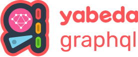

# 

[](https://badge.fury.io/rb/yabeda-graphql)
[](https://github.com/yabeda-rb/yabeda-graphql/actions/workflows/test.yml)

Built-in metrics for [GraphQL-Ruby] monitoring out of the box! Part of the [yabeda] suite.

Get sample Grafana dashboard from [Grafana.com #14774](https://grafana.com/grafana/dashboards/14774) or from [`grafana-dashboard.json`](./grafana-dashboard.json) file.

## Installation

 1. Add the gem to your Gemfile:

    ```ruby
    gem 'yabeda-graphql'

    # Then add monitoring system adapter, e.g.:
    # gem 'yabeda-prometheus'

    # If you're using Rails don't forget to add plugin for it:
    # gem 'yabeda-rails'
    # But if not then you should run `Yabeda.configure!` manually when your app is ready.
    ```

    And then execute:

    ```sh
    bundle install
    ```

 2. Hook it to your schema:

    ```ruby
    class YourAppSchema < GraphQL::Schema
      use Yabeda::GraphQL
    end
    ```

 3. And deploy it!

**And that is it!** GraphQL metrics are being collected!

## Metrics

 - **Fields resolved count**: `graphql_fields_request_count` (segmented by `type` name, `field` name and `deprecated` flag)
 - **Field resolve runtime**: `graphql_field_resolve_runtime` (segmented by `type` name, `field` name and `deprecated` flag)
 - **Queries executed count** (root query fields): `query_fields_count` (segmented by query `name` and `deprecated` flag)
 - **Mutations executed** (root mutation fields): `mutation_fields_count` (segmented by query `name` and `deprecated` flag)

That is it for now, but more will come later.

## Development

After checking out the repo, run `bin/setup` to install dependencies.

Then, run fololowing commands to run the tests against all supported versions of [GraphQL-Ruby]:

```sh
bundle exec appraisal rspec
```

You can also run `bin/console` for an interactive prompt that will allow you to experiment.

To install this gem onto your local machine, run `bundle exec rake install`. To release a new version, update the version number in `version.rb`, and then run `bundle exec rake release`, which will create a git tag for the version, push git commits and tags, and push the `.gem` file to [rubygems.org](https://rubygems.org).

## Contributing

Bug reports and pull requests are welcome on GitHub at https://github.com/yabeda-rb/yabeda-graphql.

### Releasing

1. Bump version number in `lib/yabeda/graphql/version.rb`

   In case of pre-releases keep in mind [rubygems/rubygems#3086](https://github.com/rubygems/rubygems/issues/3086) and check version with command like `Gem::Version.new(Yabeda::GraphQL::VERSION).to_s`

2. Fill `CHANGELOG.md` with missing changes, add header with version and date.

3. Make a commit:

   ```sh
   git add lib/yabeda/graphql/version.rb CHANGELOG.md
   version=$(ruby -r ./lib/yabeda/graphql/version.rb -e "puts Gem::Version.new(Yabeda::GraphQL::VERSION)")
   git commit --message="${version}: " --edit
   ```

4. Create annotated tag:

   ```sh
   git tag v${version} --annotate --message="${version}: " --edit --sign
   ```

5. Fill version name into subject line and (optionally) some description (list of changes will be taken from changelog and appended automatically)

6. Push it:

   ```sh
   git push --follow-tags
   ```

7. GitHub Actions will create a new release, build and push gem into RubyGems! You're done!

## License

The gem is available as open source under the terms of the [MIT License](https://opensource.org/licenses/MIT).

[yabeda]: https://github.com/yabeda-rb/yabeda "Extendable framework for collecting and exporting metrics from your Ruby application"
[GraphQL-Ruby]: https://graphql-ruby.org/ "Ruby implementation of GraphQL"
